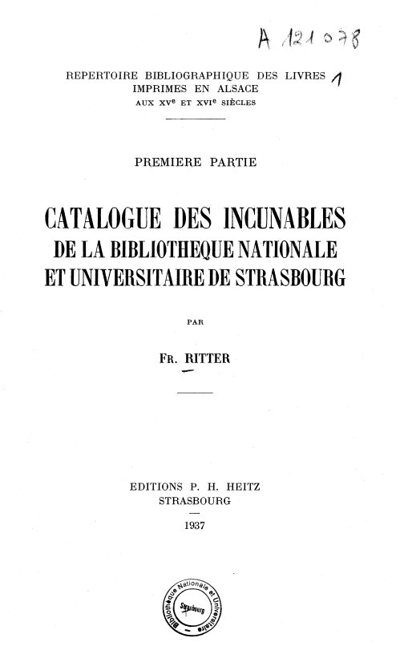
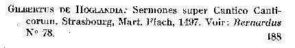
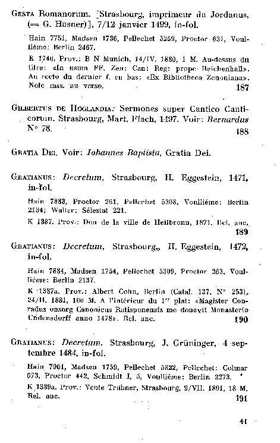

# Documentation RITTER augmenté : Les données

## Présentation 

Le Ritter est le "répertoire bibliographique des livres imprimés en Alsace aux XVe et XVIe siècles" établi par François Ritter, employé à la BNU. Son travail de répertoriation s'est étalé sur plusieurs décennie, des années 1930 aux années 1960. Par conséquent les sept livres ne respectent pas tous la même structure et certains livres ont été publiés en allemand pendant l'Occupation. 

Ritter a organisé son travail de telle sorte : 
- tout d'abord il a répertorié les imprimés présents dans les collections de la BNU par siècle (Partie 1, XVe et Partie 2, XVIe).
- ensuite il s'est attelé à répertorier les imprimés qui ne faisaient pas partie des collections de la BNU, par siècle aussi (Parties 3 et 4) 

Ce choix pose problème quand un ouvrage déjà répertorié dans un volume des parties 3 et 4 entre dans le fond de la BNU. Pareil lorsqu'un imprimé est découvert : faut-il attendre qu'il entre dans le fond BNU pour le répertorier ?

L'objectif du _Ritter augmenté_ est double : il s'agit d'une part de mettre à jour ce répertoire, et d'autre part de le rendre disponible et interopérable. 

## Type de données 

Dans l'ensemble du Ritter on trouve principalement : 
- des notices bibligraphiques qui contiennent le titre de l'oeuvre, l'auteur, le lieu d'impression, la date d'impression, le numéro de la notice, éventuellement le format, la référence à d'autres catalogue et la provenance  
- préface pour chaque partie
- la liste alphabétique des noms d'auteurs et de lieu 
- la liste des imprimeurs

## Particularités des données 

Particularité | Tâche pour laquelle c'est une difficulté potentielle |
-- | -- |
 structure des notices variable d'un volume à un autre | NER sur texte brut |
multilinguisme (français, allemand, latin) : le latin est issu de la retranscription de la page de titre dans les commentaires de la notices.| NER et alignement |
Noms de référentiels = noms propres | NER
abréviations | OCR
variation linguistique | NER et alignement

## Illustration 

