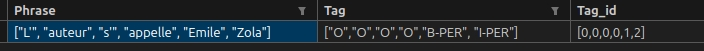

# Documentation : Annotation manuelle et extraction de l'annotation manuelle

Une étape reste nécessaire : procéder à l'annotation manuelle des entitées nommées d'une partie des données pour l'entraînement et/ou l'évaluation des modèles de NER.

L'objectif est d'obtenir un document ```csv``` comme suit : 
phrase;tag;tag_id
["L'", "auteur", "s'", "appelle", "Emile", "Zola"];["O","O","O","O","B-PER", "I-PER"];[0,0,0,0,1,2]

càd un tableau : 

En terme de structure des données il s'agit donc d'une liste contenant le texte tokenisé puis, de même longueur, l'étiquette correspondant à chaque token et enfin l'identifiant de l'étiquette. 

Ce document csv ne doit pas contenir de header, contrairement à l'illustration. Le caractère de délimitation attendu est la virgule ";". 

Le système d'étiquette proposé est OIB  : Outside, Inside, Beginning respecté par CoNNL. 

## Annotation manuelle 

Je propose de partir d'une annotation manuelle en XML effectuée avec le plugin [Emmet sur VSCode](https://code.visualstudio.com/docs/editor/emmet) 


## Création du jeu de données

Le programme ```creation_dataset.py``` extrait les données des pages XML en un document csv. Le fichier ```params.py``` enregistre les paramètres : 

>class_names = ['O', 'PER', 'DATE', 'LOC']

Liste des classes pour l'étiquettage des tokens. Cette liste doit avoir autant d'item que ```tags_to_extract``` et l'ordre d'apparence doit correspondre entre le nom de l'élément XML et le nom de sa classe attendue. Les valeurs Beginning et Inside sont ajoutées automatiquement.

>tags_to_extract = ['_', 'persName', 'placeName', 'date']

Liste des éléments du XML à extraire : la première valeur est ici un nom d'élément inexistant pour correspondre à la classe "O" aka 'Other' qui est aussi étiquettée. 

>by_element = "div"

Nom de l'élément par qui permet de découper les pages XML en sous-parties. Si ```by_element``` a la valeur ```None```, fera l'extraction de la page entière.  


>tokenizer = "split" # les choix sont ["spacy", "split"]

Possibilité de tokeniser en fonction des espaces avec "split" ou avec spaCy. Pour procéder à une tokenization spaCy il faut télécharger le modèle :

```python -m spacy download fr_core_news_sm``` 


>xml_dir = "data/test"

Chemin contenant le corpus de pages XML encodées avec les Entitées Nommées

>outdoc = "creation_dataset/out/data.csv"

Chemin et nom du document contenant les données extraites (càd text;tag;id_tag;provenance). 

Quand tous les paramètres sont correctement remplis on peut procéder à la création automatique du jeu de données complet en ligne de commande : 

```python creation_dataset.py```

### Division du document en jeux d'entrainement et de test

Le programme ```train_test_split.py``` permet de diviser le jeu complet en jeux d'entraînement et de test pour l'évaluation des modèles. 

```python train_test_split.py <doc> <outdir>```

Avec ```doc``` document csv données en sortie du programme creation_dataset.py et ```outdir``` dossier où se trouveront les jeux après la division du jeu complet. La division est à 80% pour le jeu d'entrainement et 20% pour le jeu de test. 


### Extraction des noms

Le programme ```extract_names.py``` permet d'extraire du document donné en sortie de creation_dataset.py la liste des noms au format txt. 

```python extract_names.py <doc> <outdoc>```

Avec ```doc``` document csv données en sortie du programme creation_dataset.py et ```outdoc``` document txt de sortie. 


