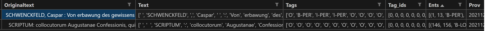

# Documentation : Annotation manuelle et extraction de l'annotation manuelle

Une étape reste nécessaire : procéder à l'annotation manuelle des entitées nommées d'une partie des données pour l'entraînement et/ou l'évaluation des modèles de NER.
 
L'objectif est d'obtenir un document ```csv``` comme suit : 
originaltext;text;tags;tag_ids;ents;prov
"L'auteur s'appelle Emile Zola";["L'", "auteur", "s'", "appelle", "Emile", "Zola"];["O","O","O","O","B-PER", "I-PER"];[0,0,0,0,1,2][{'entity": "Emile", "label": "B-PER"}, [(19, 24, B-PER), (25,29, I-PER)];exemple.xml

càd un tableau :  

En terme de structure des données il s'agit d'un fichier csv avec en première colonne le texteoriginal,puis d'une liste contenant le texte tokenisé puis, de même longueur, l'étiquette correspondant à chaque token, puis la liste avec l'identifiant des étiquettes, les entités nommées avec l'index de début et de fin dans le text original et enfin la provenance du texte (nom du document d'origine). 

Le système d'étiquette proposé est OIB  : Outside, Inside, Beginning respecté par CoNNL. Mais il est possible de faire une annotation sans (voir paramètres). 

## Annotation manuelle 

L'annotation manuelle en XML a été effectuée à l'aide du Plugin [Emmet sur VSCode](https://code.visualstudio.com/docs/editor/emmet). J'ai divisé les notices avec une balise ```<div>``` et un ```@type``` qui peut avoir la valeur ```"notice"``` ou ```"renvoi"```. A l'intérieur de ces balises se trouvent les balises suivantes en fonction du besoin : 
balise|commentaire
--|--
persName|nom de personne complet, sans distinction prénom/nom. Les éditeurs sont aussi dans cette balise.
placeName|nom de lieux 
date|date en entier, qu'elles soient formulées "Anno MCII" ou "1502"

NB : les noms de référentiels comme "Hain, Schmidt" ne sont pas annotés comme nom de personne. 

## Création du jeu de données

Le programme ```creation_dataset.py``` extrait les données des pages XML en un document csv. Le fichier ```params.py``` enregistre les paramètres : 

>class_names = ['O', 'PER', 'DATE', 'LOC']

Liste des classes pour l'étiquettage des tokens. Cette liste doit avoir autant d'item que ```tags_to_extract``` et l'ordre d'apparence doit correspondre entre le nom de l'élément XML et le nom de sa classe attendue. Les valeurs Beginning et Inside sont ajoutées automatiquement.

>tags_to_extract = ['_', 'persName', 'placeName', 'date']

Liste des éléments du XML à extraire : la première valeur est ici un nom d'élément inexistant pour correspondre à la classe "O" aka 'Other' qui est aussi étiquettée. 

>by_element = "div"

Nom de l'élément par qui permet de découper les pages XML en sous-parties. Si ```by_element``` a la valeur ```None```, fera l'extraction de la page entière en cherchant l'élément "body".


>tokenizer = "split" # les choix sont ["spacy", "split"] ou un modèle disponible sur Hugging Face

Possibilité de tokeniser en fonction des espaces avec "split" ou avec spaCy. Pour procéder à une tokenization spaCy il faut télécharger le modèle français en amont : 

```python -m spacy download fr_core_news_sm``` 

Si le modèle choisi est spaCy le programme enregistrera automatiquement le document au format .spacy aussi en prévision des entraînements.


>xml_dir = "data/test"

Chemin contenant le corpus de pages XML encodées avec les Entitées Nommées

>datadir = "data"

>datadoc = "donnees_extraites

Chemin et nom du document de sortie. 

Quand tous les paramètres sont correctement remplis on peut procéder à la création automatique du jeu de données complet en ligne de commande : 

```python creation_dataset.py```

### Division du document en jeux d'entrainement et de test

Le programme ```train_test_split.py``` permet de diviser le jeu complet en jeux d'entraînement et de test pour l'évaluation des modèles. 

```python train_test_split.py <doc> <outdir>```

Avec ```doc``` document csv données en sortie du programme creation_dataset.py et ```outdir``` dossier où se trouveront les jeux après la division du jeu complet. La division est à 80% pour le jeu d'entrainement et 20% pour le jeu de test. 


### Extraction des noms

Le programme ```extract_names.py``` permet d'extraire du document donné en sortie de creation_dataset.py la liste des noms au format txt. 

```python extract_names.py <doc> <outdoc>```

Avec ```doc``` document csv données en sortie du programme creation_dataset.py et ```outdoc``` document txt de sortie. 


