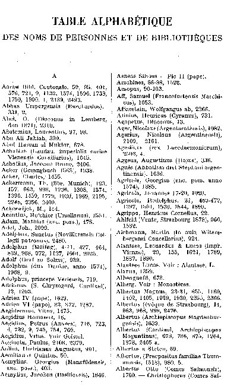

# Documentation : Stratégies de NER

## Expressions régulières

Objectif : exploiter la liste alphabétique des noms de personne.  



### Programme Regex

Les paramètres du programme se trouvent dans le programme ```params.py```. Tout est construit autour du document ```datadoc``` généré par le programme ```creation_dataset.py``` càd un csv contenant une liste de tokens étiquettés.

Il est possible d'ajouter des termes à l'antidictionnaire : ces mots seront classés en "O" ou autre. Et PLACENAME contient les EN de lieux. Les dates sont extraites avec la regex DATE_pattern. 

Le programme a deux arguments optionnels :

 ```--writeconll``` qui écrit automatiquement le document de sortie au format CoNLL càd un tsv avec pour chaque ligne un seul token suivi de son étiquette correcte et de son étiquette prédite par le programme regex. Pour que ce fichier ne soit pas écrit il faut ajouter l'option : ```--no-writeconll```


```--confmatrixnorm``` qui écrit la matrice de confusion normalisée. Pour optenir la matrice non normalisée il faut ajouter l'option ```--no-confmatrixnorm```. 


## GROBID

## modèles de spaCy


La bibliothèque spaCy a ses propres modèles avec lesquels il est possible de faire de la reconnaissance d'EN : pour le français le modèle de base est [```fr_core_news_sm```]'(https://spacy.io/models/fr) entraîné sur les jeux de données Universal Dependencies French Sequoai et WikiNER notamment. 
Le programme standalone ```spacy_ner.py``` effectue l'extraction des EN d'un document en texte brut. 

Il est possible de choisir un autre modèle que celui proposer par défaut en passant en argument --model. L'argument --outpath permet d'enregister les noms extraits avec leur étiquette (formats de sortie acceptés : txt et csv/tsv )


```python programmes_standalone/spacy_ner.py data/doc.txt --model fr_core_news_sm --outpath out/extraction_spacy_fr.csv```


## Transformers

### Modèles pré-entraînés sans spécialisation sur nos données

De nombreux modèles Transformers sont disponibles pour la Reconnaissance d'EN sur [HuggingFace](https://huggingface.co/). Il est possible en quelques lignes de code d'effectuer une extraction simple. C'est ce qu'effectue le programme standalone ```testing_hf_ner.py``` qui fonctionne comme le programme précédent de spacy en ligne de commande comme dans l'exemple : 

```python programmes_standalone/testing_hf_ner.py data/doc.txt --model Jean-Baptiste/camembert-ner --outpath out/extraction_camembert.csv```

L'utilisation de ces modèles n'oblige pas de les avoir téléchargés puisque on peut les utiliser grâce à l'API de la bibliothèque Python ```transformers```. 

Les EN donnés en sortie sont souvent scindés en plusieurs groupes (nommés des tokens) car la cette tokenisation permet à un modèle de gérer les mots peu communs. Un underscore sert à marquer le début d'un mot dans une série de tokens.  

## Affinage de Transformers sur nos données

Il est possible d'affiner des modèles, qu'ils aient été eux-mêmes affinés ou non au préalable. Pour cela il est nécessaire d'avoir des données annotées avec un certain degré de fiabilité, et ce dans le plus grand nombre possible. On peut effectuer un affinage directement avec la bibliothèque transformers. Le notebook ```training_llm.ipynb``` donne un aperçu de ce genre d'entrainement. 

Sinon il est possible d'entrainer un modèle de manière simplifié avec spaCy en suivant la documentation [5. Entrainement_modele_avec_spacy](/documentation/5.Entrainement_modele_avec_spacy.md). 

## IA Génératives et prompt engineering

La dernière possibilité est d'utiliser des LLMs génératifs comme ChatGPT d'OpenAI ou Mixtral de MistralAI (entreprise française avec un modèle open source). Pour cela on peut soit utiliser ces modèles via l'interface web proposée par l'entreprise ([mistral](https://chat.mistral.ai/), et [chatgpt](chat.openai.com)) soit utiliser leur API (payantes). 


### NER avec interface Web

Les modèles sont limité par la quantité d'informations et de tokens qu'ils peuvent 'comprendre' en une seule fois. La "fenêtre contextuelle" est le nombre de token en entrée maximum que peut recevoir un modèle. Sachant que plus on donne de tokens en entrée plus le modèle a de chance d'halluciner, càd donner en sortie qqch qui peut ou non avoir l'air cohérent mais qui ne répond pas réellement ou correctement à la requête (aussi appelé un prompt) énoncée. Pour la tâche de NER, les modèles peuvent halluciner des étiquettes qui n'existent pas, ou répéter à l'infini des portions de phrase. 

Quoi qu'il en soit, il est nécessaire de diviser notre jeu de données qui est trop volumineux pour rentrer dans une seule requête. 


## IA génératives par API
