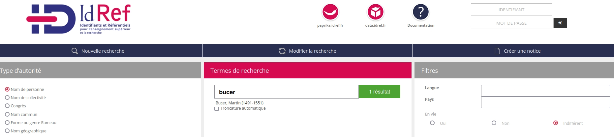
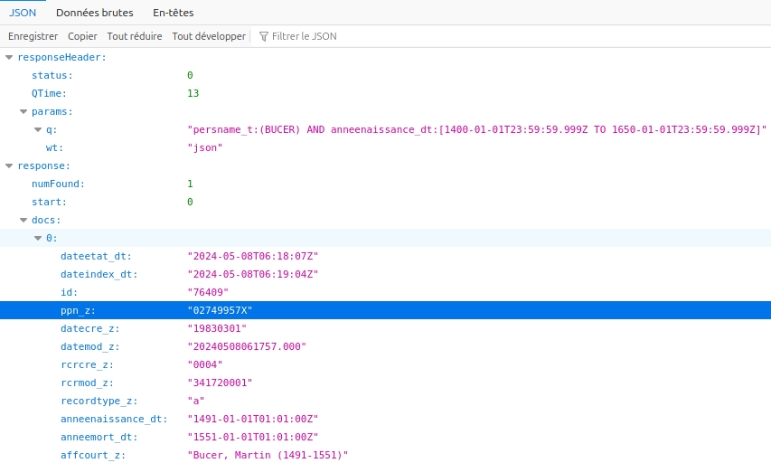

# Alignement avec référentiel idRef


Dernière étape de la chaîne de traitement : l'alignement des noms de personnes extraits (auteurs) avec leur identifiant unique (URI). Pour ce projet c'est le référentiel [IdRef](www.idref.fr) qui est utilisé, mais il en existe d'autres comme Wikidata. 

Il y a deux plusieurs manières de trouver l'identifiant IdRef d'une personnes. La façon la plus simple et de passer par le moteur de recherche du site internet. 

On voit l'URI apparaître à la fin de l'URL ici 02749957X 

Mais nous pouvons aussi automatiser ce travail en requêtant leur moteur de recherche utilisé en interne [Solr](https://fr.wikipedia.org/wiki/Apache_Solr). 
Dans ce cas les index possibles pour filtrer les recherches sont disponbles sur [le site de l'abes](https://documentation.abes.fr/aideidrefdeveloppeur/index.html#index)

J'ai placé en paramètre de recherche le nom de l'auteur avec persname_t (le "_t" signifie qu'il ne s'agit pas d'une recherhce exacte mais qu'il faut chercher dans tout le texte, "_s" effectuerait une recherche exacte du nom), ainsi qu'une fenêtre pour l'année de naissance allant de 1400 à 1650 avec l'index datenaissance_t. l'option ```wt``` permet de changer la sortie (par défaut en HTML) au format JSON. La requête formée est envoyée directement dans l'URL sous cette forme : 

https://www.idref.fr/Sru/Solr?q=persname_t:(BUCER)%20AND%20anneenaissance_dt:[1400-01-01T23:59:59.999Z TO 1650-01-01T23:59:59.999Z]&wt=json


A partir de la réponse du site à la requête on obtient un document au format JSON dont on peut extraire les éléments qui nous intéressent comme l'identifiant IdRef (enregistré sous le nom ```ppn_z```) 

NB : si le programme est lent, c'est possiblement à cause de la version du module ```requests```. Le downgraded à la version 2.27.1 peut fonctionner : ``` pip install requests==2.27.1``` 


L'autre solution est d'effectuer une requête SPARQL via l'[endpoint Virtuoso d'idref](https://data.idref.fr/sparql). J'ai formulé la requête suivante : 
>                PREFIX bio: <http://purl.org/vocab/bio/0.1/> 
                PREFIX foaf: <http://xmlns.com/foaf/0.1/> 
                PREFIX xsd: <http://www.w3.org/2001/XMLSchema#> 
                select ?nom ?naissance ?id
                where {{
                ?id foaf:name ?nom;
                    bio:event [a bio:Birth ; bio:date ?naissance] ; 
                                             foaf:name ?nom.
  					?nom bif:contains "{ent.encode('utf-8').decode('utf-8')}".

                FILTER (xsd:integer(?naissance)<1800)

                }}
                LIMIT 10

Mais il est possible que la requête ne fonctionne pas très bien pour l'instant. 

## Automatisation avec le programme ```alignement_encodage_xml.py``` 

```alignement_encodage_xml.py```  permet d'effectuer à partir du paramétrage de ```params.py``` l'alignement des EN de personnes qui ont été enregistrées dans un document csv (avec 1 colonne du texte tokenisé et 1 colonne qui contient les étiquettes alignées sous leur forme d'identifiant (1 pour PER par exemple)). 

Le programme en ligne de commande prend deux options --writetsv/--no-writetsv pour écrire les tokens avec leur étiquette EN et leur identifiants idref au format .tsv et --writexml/--no-writexml pour réencoder le texte d'origine en XML avec les 
